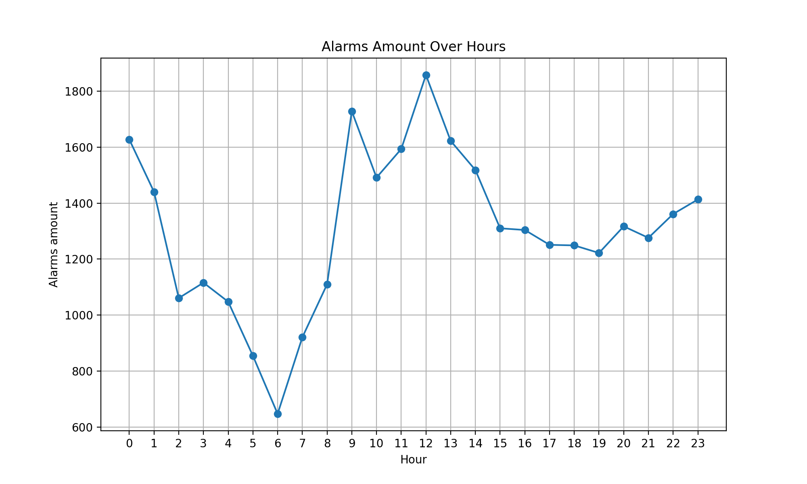
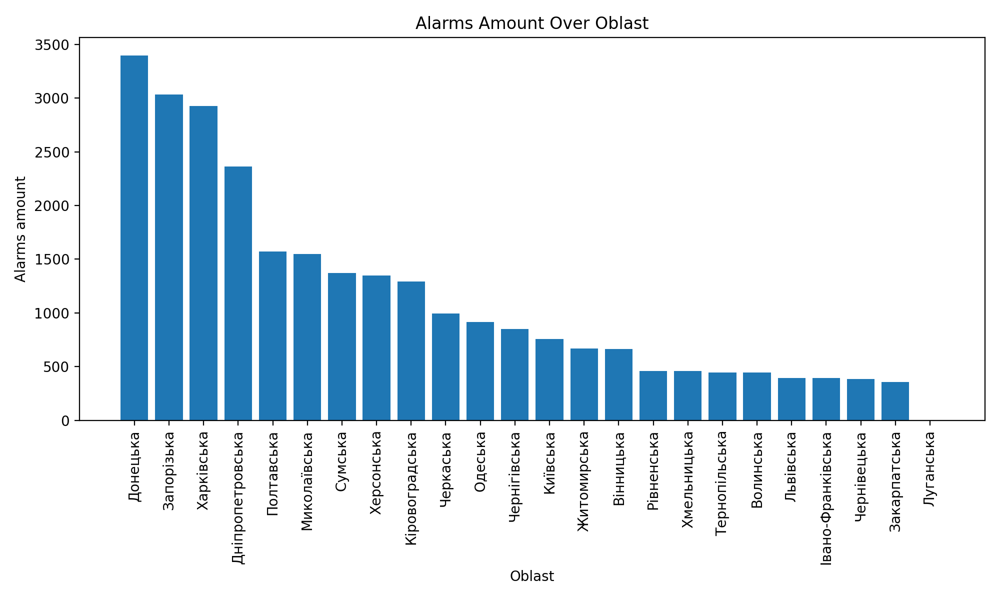

# 🛩️ Air Alarms Analysis in Ukraine

## 📖 Overview

This project is dedicated to the analysis of air alarms in Ukraine, providing valuable insights into air quality warnings. Leveraging the Pyrogram library for Telegram API interactions and Django ORM for database management, the project collects air alarm messages from a designated Telegram channel. The scraped data is persisted in an SQLite database, and subsequent analysis is performed using Pandas, NumPy, and Matplotlib to clean and visualize the information.

## ✨ Features
- **Telegram Channel Scraping:** Utilizing Pyrogram, the project efficiently scrapes air alarm messages from a designated 
Telegram channel.
- **Database Persistence with Django ORM**: The collected data is stored and managed in an SQLite database using Django 
  ORM, ensuring efficient data retrieval and organization.
- **Data Cleaning and Plotting**: Pandas and NumPy are employed to clean and process the data, while Matplotlib is used 
  for creating insightful visualizations.
- **Data Refreshment**: The project provides a possibility to refresh the data by re-scraping the channel (you can 
  refresh the data via simple cli when run main.py).

## 🚀 Getting Started

1. Clone the repository and set up the virtual environment:
    ```bash
    git clone https://github.com/eduardhabryd/ds-alarms-project.git
    cd ds-alarms-project
    python -m venv venv
    source venv/bin/activate # or venv\Scripts\activate in Windows
    pip install -r requirements.txt
    ```
2. Obtain Telegram `API_ID` and `API_HASH`, you can follow this [instructions](https://core.telegram.org/api/obtaining_api_id#obtaining-api-id).
3. Specify `API_ID` and `API_HASH` in `scrap/.env` file.
4. Run the script to scrape air alarm messages, persist data, and generate visualizations.
    ```bash
    python main.py
    ```
5. Explore the results in `./images`

## 📊 Sample Results


